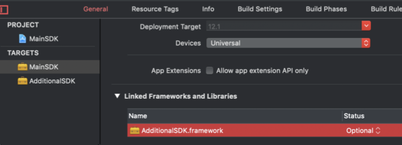

# Swift frameworks with Optional feature frameworks

## Idea

The idea of the setup shown is to prove on example, how to:

1. Setup **closed source** frameworks with CocoaPods
2. Utilize **weak linking** between them
3. Make features that depends on whether the additional frameworks are linked or not

## Overview

The project is composed of three parts:

### 1. JustAnApp

Simple app, illustrating situation, where you can include one or more frameworks via CocoaPods.

When launched (only iPhone Simulator for now!) the screen would turn:
- green if AdditionalSDK is present
- gray if not

Pressing TEST button would print info to the console, using additional SDK features or not.

> __To enable/disable AdditionalSDK__ comment or uncomment line \#7 in Podfile, and reload pods by executing "rake pods" from main app dir.

### 2. SDKProject

Shows how to setup frameworks (MainSDK + AdditionalSDK) in a way, that AdditionalSDK is optional, and the MainSDK would change behaviour depending on its availability.

That includes:
- telling whether AdditionalSDK is available at all
- "safe" adopting AdditionalSDK protocols
- performing tasks differently, depending on additional features availability

To make weak link between frameworks, you can select optional in linked frameworks section:

### 3. SDKProducts

Just a Container for "vendored_frameworks". They are compiled only for simulator now.

In the "final setup", when making similar setup to ship your frameworks, you'd probably be using fat binaries, so your users would be able to build for both devices and simulators.

## Summary + Where to go from Where

It seems, that when using Objective-C, it is possible to take advantage of weak linking (and thus "optional" frameworks). It seems it is impossible though to do that with Swift only setup.

__Potential Improvements:__ Currently, the MainSDK "Interop" objc files are public. You can make them "private", and still use from Swift, using these hints:

[https://medium.com/@amichnia_31596/creating-swift-framework-with-private-objective-c-members-the-good-the-bad-and-the-ugly-4d726386644b](https://medium.com/@amichnia_31596/creating-swift-framework-with-private-objective-c-members-the-good-the-bad-and-the-ugly-4d726386644b)
